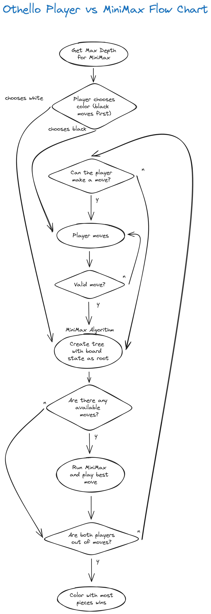

# Othello AI

## Play Othello against an AI opponent. Developed in Python.

*Authors: Katerina Mantaraki, Alexios Papadopoulos Siountris, Sarkis Samouelian*

## Instructions

1. Download a Python version greather than 3.6
2. Clone the repository
3. `cd othello-ai`
4. Run `main.py` with your python version of choice (eg. `python3.10 main.py`)

